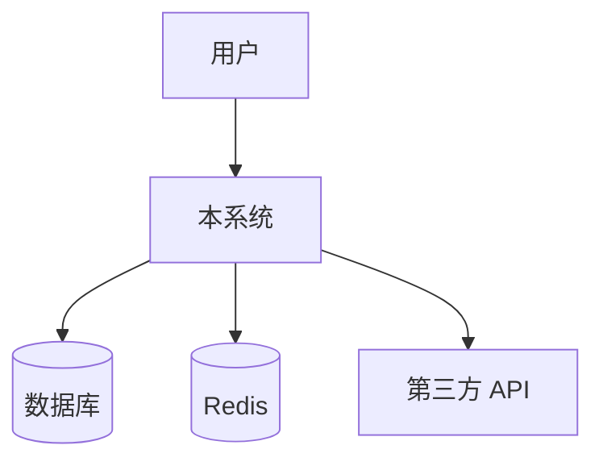
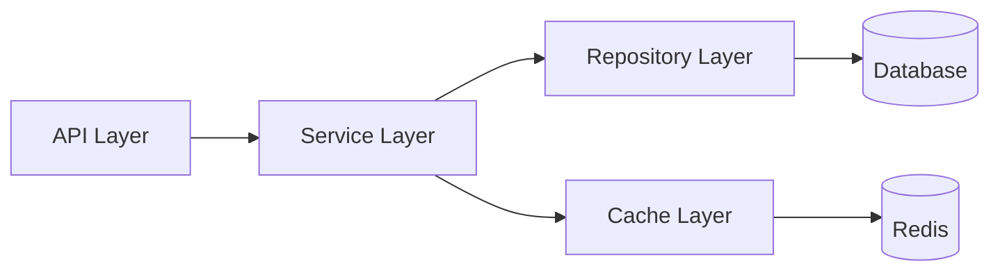
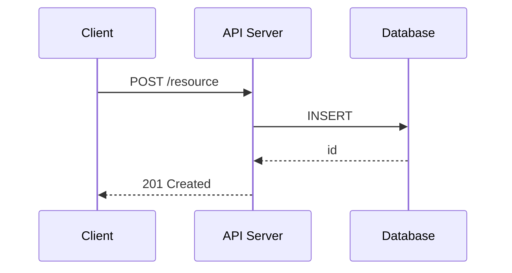

# 架构文档与 ADR 生成规范

## 架构文档结构

```markdown
# 系统架构

## 概览
[1-2 段描述系统整体功能和边界]

## 架构图（Mermaid）
[见下方 Mermaid 模板]

## 核心模块

### 模块名称
- **职责**：负责什么
- **对外接口**：暴露哪些能力
- **依赖**：依赖哪些其他模块或外部服务
- **关键约束**：设计限制或注意事项

## 数据流
[描述主要数据在系统中的流转路径]

## 关键设计决策
[链接到对应 ADR 文件]

## 技术栈
| 层次 | 技术 | 选择理由 |
|------|------|----------|
| 前端 | React + TypeScript | ... |
| 后端 | Go + gin | ... |
| 数据库 | PostgreSQL | ... |
```

## Mermaid 图模板

### 系统上下文图（最高层级）


### 模块依赖图


### 数据流图（时序）


## 扫描要点（生成架构图前）
```bash
# 识别模块结构
find src/ -maxdepth 2 -type d
# 识别服务间依赖
grep -r "import.*from\|require(" src/ --include="*.ts" | grep -v "node_modules"
# 识别外部服务
grep -r "process.env\|os.environ\|config\." src/ | grep -i "url\|host\|endpoint"
```

---

## ADR（架构决策记录）规范

遵循 [MADR](https://adr.github.io/madr/) 格式，存储在 `docs/decisions/` 目录。

### 文件命名
`docs/decisions/NNNN-短横线命名.md`（如 `0001-use-postgresql.md`）

### ADR 模板
```markdown
# ADR-NNNN: [决策标题]

**状态**：Proposed | Accepted | Deprecated | Superseded by ADR-XXXX

**日期**：YYYY-MM-DD

## 上下文（Context）
描述问题背景、约束条件、为什么需要做决策。

## 考虑的选项
1. 选项 A：[描述]
2. 选项 B：[描述]
3. 选项 C：[描述]

## 决策（Decision）
选择 **选项 X**，原因：...

## 后果（Consequences）
**好处**：
- ...

**坏处/权衡**：
- ...

**风险**：
- ...
```

### 触发时机
用户说"记录一个架构决策"、"为什么用 X"、"决定用 X 而不是 Y"时，主动提议生成 ADR。
